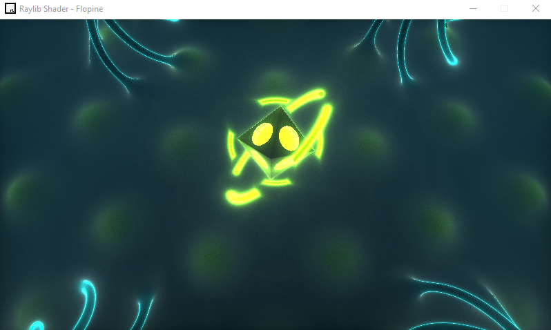

# RAYLIB SHADER INTEGRATION

> This is a simple way to use raylib and integrate a Shadertoy shader. The objective was to be able to load a shadertoy shader with another framework.

This project is based on the [Raylib Quickstart Repository](https://github.com/raylib-extras/raylib-quickstart).

## HOW TO MAKE IT WORK

 - Clone this repository
 - Build the .sln with build-VisualStudio2022.bat
 - Open and Run .sln file.

## Result

This is a shader developped by Flopine available [here](https://www.shadertoy.com/view/tdBGWD).
